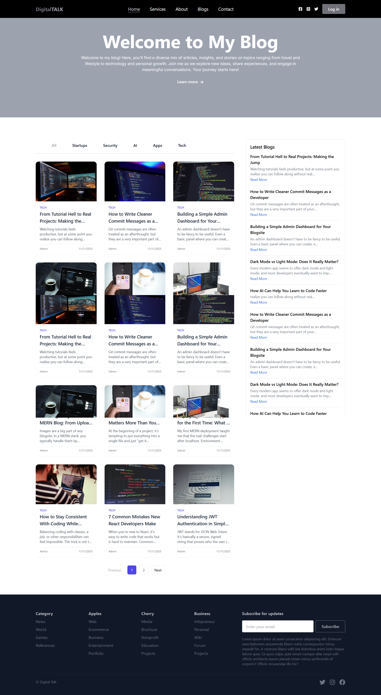
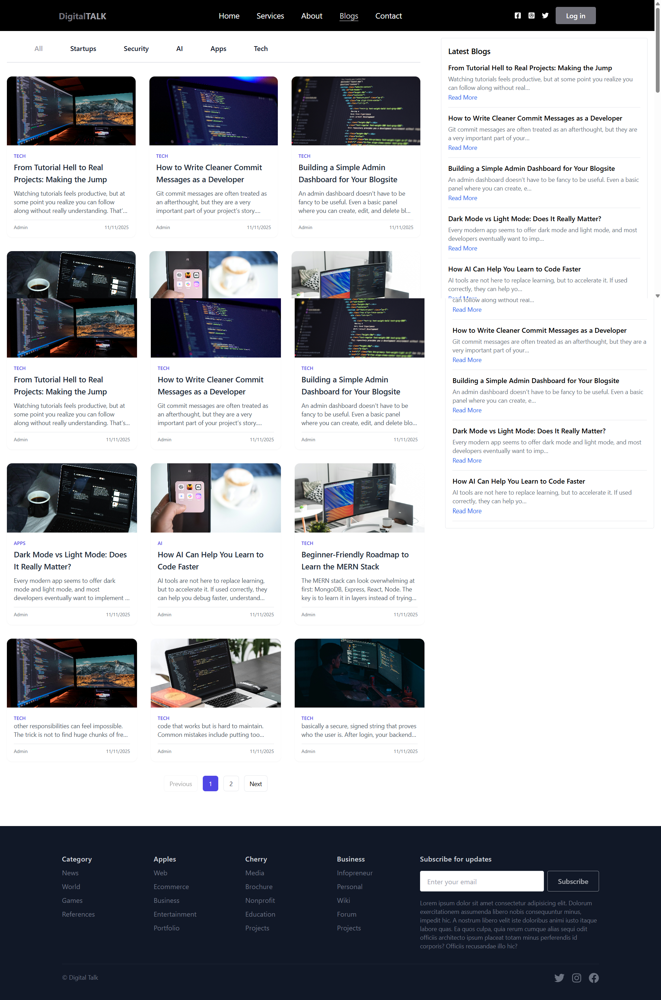
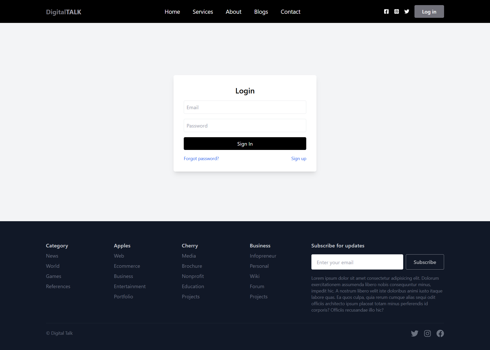
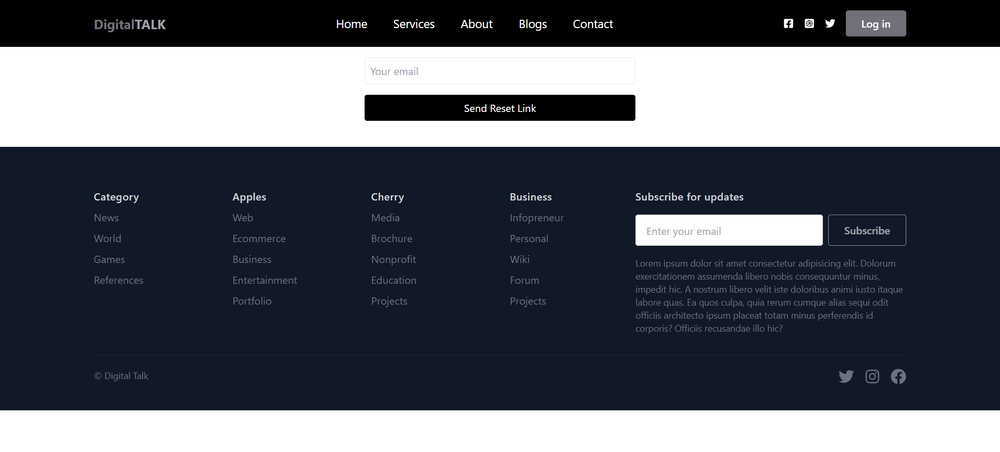
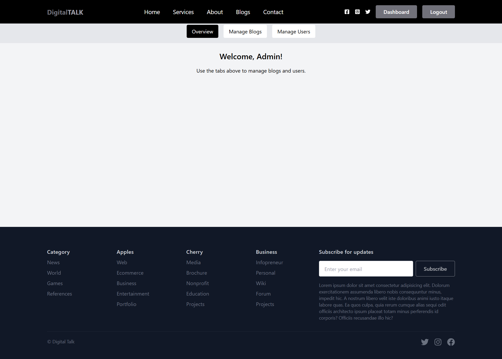
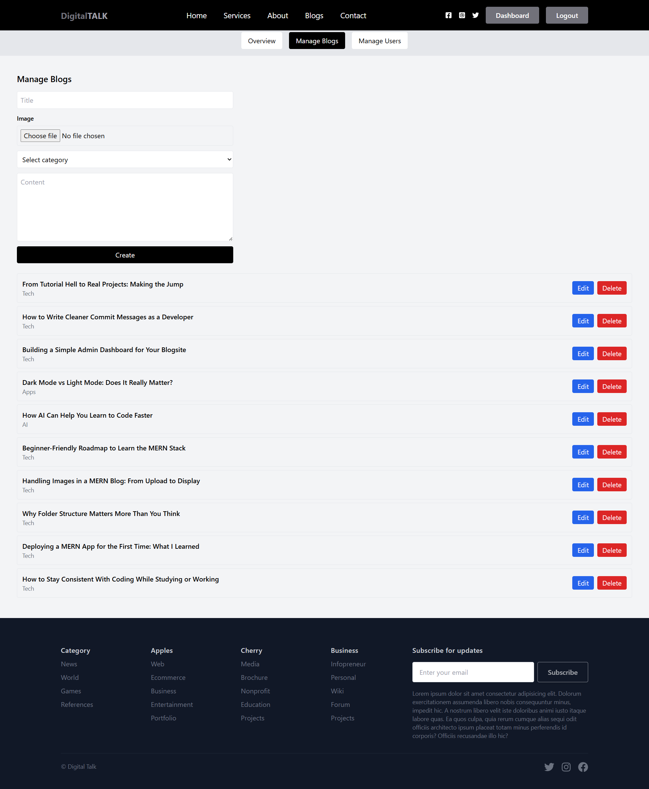
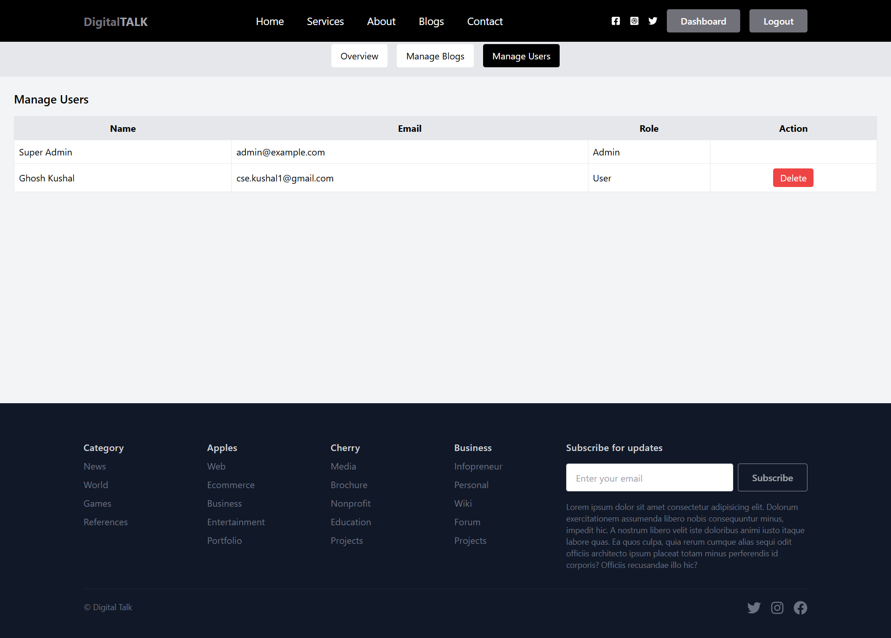
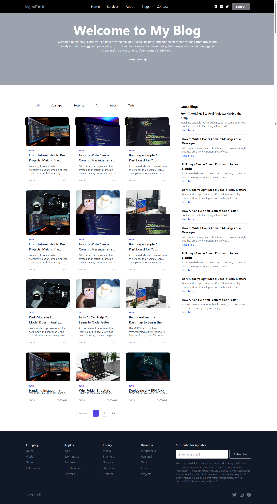
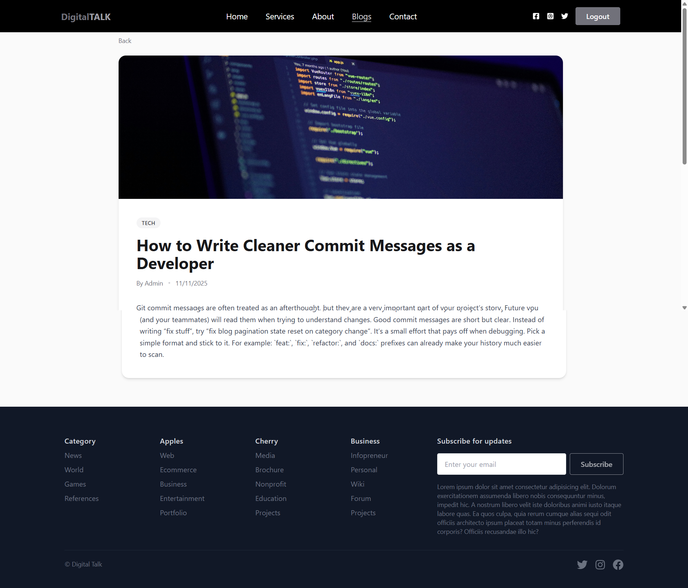

# Digital Talk – Blogsite

Digital Talk is a full-stack Blog website built with the MERN stack (MongoDB, Express.js, React.js, Node.js). It features Authentication, blog management, categories, and admin panel included.

# Screenshots

<table>
  <tr>
    <td></td>
  </tr>
  <tr>
    <td></td>
    <td></td>
    <td></td>
  </tr>
  <tr>
    <td></td>
    <td></td>
    <td></td>
  </tr>
  <tr>
    <td></td>
    <td></td>
    <td></td>
  </tr>
</table>

## Features

### ✅ Frontend (React)

- Home page with:
  - Latest blogs section
  - Category-wise blog listing
  - Sidebar with recent/featured blogs
- Individual blog details page with cover image & full content
- Authentication pages:
  - Login
  - Register
  - Forgot Password
  - Reset Password

### ✅ Backend (Node.js + Express)

- RESTful API with JWT-based authentication
- MongoDB (Atlas) for:
  - Users
  - Blogs
  - Subscribers
- Password hashing using `bcrypt`
- File upload (blog images) with static `/uploads` serving
- Routes & controllers for:
  - User Authentication
  - Blog Management (create, read, update, delete)
  - Blog listing with pagination
  - Single blog fetch by ID / numericId
  - Password reset via email 

### ✅ Admin Dashboard

- Admin/user login via same auth system (role-based access)
- Create new blog with title, content, category & cover image
- Edit existing blogs
- Delete blogs 

---

## 🚀 Getting Started

### 1. Clone the repository
```bash
git clone https://github.com/your-username/digital-talk.git
cd digital-talk
```

### 2. Setup Backend
```bash
cd backend
npm install
```

Create a `.env` file in the `backend/` directory:
```env
PORT=5000
MONGO_URI=your_mongodb_connection_string
JWT_SECRET=your_jwt_secret
CLIENT_ORIGIN=client_origin
ADMIN_EMAIL=your_admin_email
ADMIN_PASSWORD=admin_password
SMTP_HOST=your_smtp_host_email
SMTP_PORT=your_smtp_port
SMTP_USER=your_smtp_user_email
SMTP_PASS=your_smtp_user_pass
SMTP_FROM=smtp_from
```

Start the backend server:
```bash
nodemon index.js
```

### 3. Setup Frontend 

Create a `.env` file in the `frontend/` directory:
```env
VITE_API_URL=vite_api_url
```

```bash
cd frontend
npm install
npm run dev
```

---


